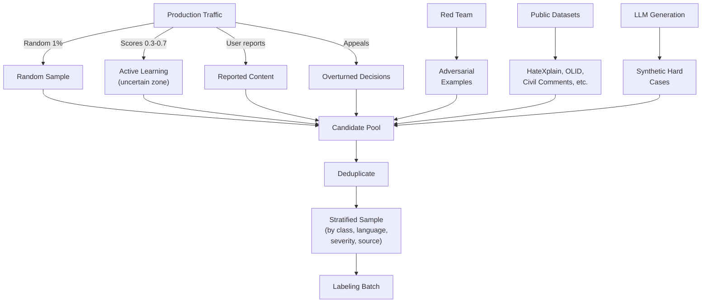
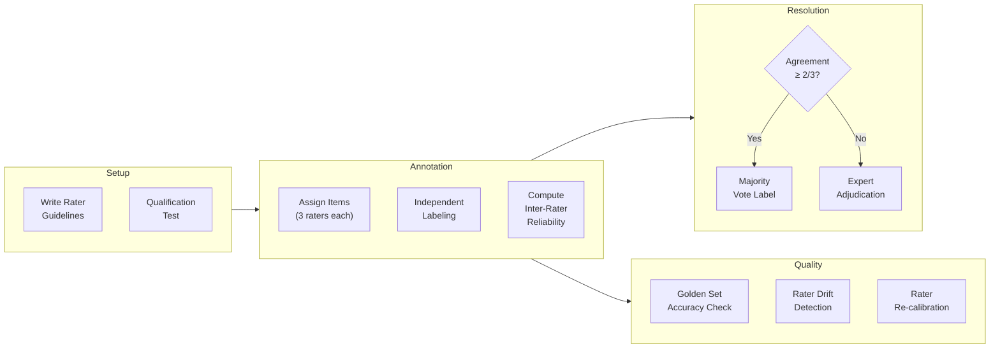
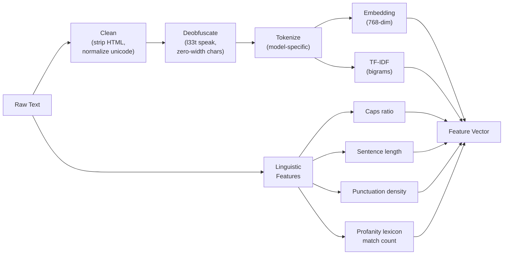
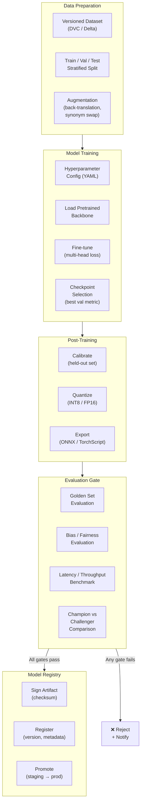
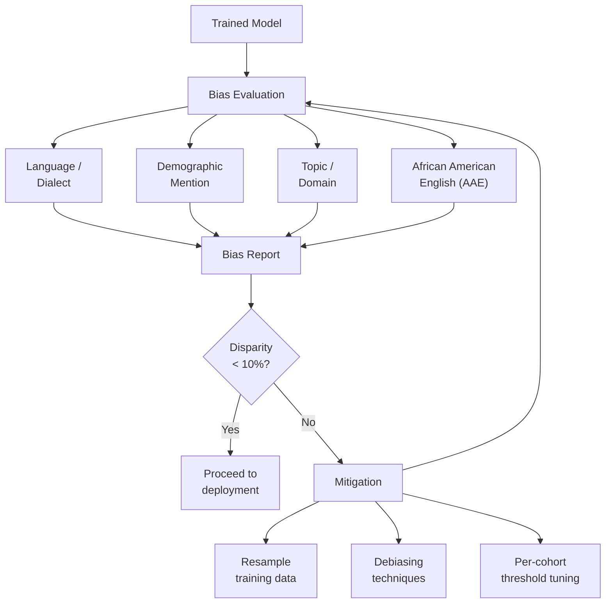

# Abuse Classifier System — Data Pipeline & Model Training

> **Version**: 1.0.0  
> **Status**: Draft  
> **Last Updated**: 2026-04-08

---

## Table of Contents

1. [Data Strategy Overview](#1-data-strategy-overview)
2. [Abuse Taxonomy and Label Schema](#2-abuse-taxonomy-and-label-schema)
3. [Data Collection](#3-data-collection)
4. [Labeling Pipeline](#4-labeling-pipeline)
5. [Feature Engineering](#5-feature-engineering)
6. [Model Architecture](#6-model-architecture)
7. [Training Pipeline](#7-training-pipeline)
8. [Evaluation Framework](#8-evaluation-framework)
9. [Bias and Fairness](#9-bias-and-fairness)
10. [Model Card Template](#10-model-card-template)

---

## 1. Data Strategy Overview

```mermaid
flowchart LR
    subgraph Sources["Data Sources"]
        PROD["Production traffic<br/>(sampled)"]
        ACTIVE["Active learning<br/>(near-threshold)"]
        ADVERSARIAL["Red team /<br/>adversarial"]
        EXTERNAL["Public datasets<br/>(HateXplain, etc.)"]
        SYNTHETIC["Synthetic<br/>(augmented / LLM)"]
    end

    subgraph Processing["Processing"]
        DEDUP["Deduplication<br/>(minhash / simhash)"]
        PII["PII Scrubbing<br/>(pseudonymize)"]
        BALANCE["Class Balancing<br/>(stratified sample)"]
    end

    subgraph Labeling["Labeling"]
        GUIDE["Guidelines +<br/>Examples"]
        RATERS["Multi-rater<br/>Annotation"]
        ADJ["Adjudication<br/>(disagreement)"]
        GOLD["Golden Set<br/>Curation"]
    end

    subgraph Output["Versioned Datasets"]
        TRAIN_SET["Train Set"]
        VAL_SET["Validation Set"]
        TEST_SET["Test Set<br/>(held-out)"]
        GOLDEN["Golden Eval Set<br/>(curated, stable)"]
    end

    Sources --> Processing --> Labeling --> Output
```



**Principles**:

- **Data versioning**: Every dataset is immutable, versioned (DVC or Delta Lake), and linked to training runs.
- **Privacy-first**: PII is scrubbed or pseudonymized before labeling; raw content is access-controlled with TTL.
- **Representativeness**: Datasets must cover languages, dialects, and demographic groups proportional to production traffic (with oversampling for underrepresented abuse patterns).

---

## 2. Abuse Taxonomy and Label Schema

### 2.1 Primary Classes

```
ABUSE_TAXONOMY
├── HATE_SPEECH
│   ├── hate_race_ethnicity
│   ├── hate_gender_sex
│   ├── hate_religion
│   ├── hate_disability
│   ├── hate_sexual_orientation
│   └── hate_other
├── VIOLENCE
│   ├── violence_threat_direct
│   ├── violence_threat_indirect
│   ├── violence_glorification
│   └── violence_graphic_content
├── HARASSMENT
│   ├── harassment_targeted
│   ├── harassment_bullying
│   └── harassment_doxxing
├── SEXUAL_CONTENT
│   ├── sexual_explicit
│   ├── sexual_solicitation
│   └── csam_adjacent (ESCALATION REQUIRED)
├── SELF_HARM
│   ├── self_harm_ideation
│   ├── self_harm_instructions
│   └── self_harm_glorification
├── SPAM_SCAM
│   ├── spam_commercial
│   ├── spam_engagement
│   ├── scam_financial
│   └── scam_phishing
├── MISINFORMATION
│   ├── misinfo_health
│   ├── misinfo_political
│   └── misinfo_dangerous
└── POLICY_SPECIFIC
    ├── impersonation
    ├── copyright_claim
    └── platform_manipulation
```

### 2.2 Label Schema (per item)

```json
{
  "item_id": "item_abc123",
  "content_hash": "sha256:...",
  "labels": [
    {
      "class": "violence_threat_direct",
      "parent_class": "VIOLENCE",
      "severity": "high",
      "confidence": "certain",
      "target_group": "individual",
      "annotator_id": "rater_42",
      "timestamp": "2026-04-08T10:00:00Z"
    }
  ],
  "multi_label": true,
  "language": "en",
  "content_type": "comment",
  "adjudication_status": "agreed",
  "golden_set": false,
  "dataset_version": "v3.2.0"
}
```

### 2.3 Severity Scale

| Level | Name | Definition | Example |
|-------|------|-----------|---------|
| 1 | Low | Borderline, context-dependent | Edgy humor that some may find offensive |
| 2 | Medium | Clear policy violation, non-urgent | Slur used in a heated argument |
| 3 | High | Serious violation, harmful | Direct threat of violence against a person |
| 4 | Critical | Illegal or imminent danger | CSAM, credible bomb threat, active self-harm crisis |

---

## 3. Data Collection

### 3.1 Sources and Sampling Strategy



### 3.2 Active Learning Strategy

```
Score Distribution After Tier-1:
                                                  
   Count                                          
    │                                              
    │  █                                     █     
    │  █ █                                 █ █     
    │  █ █ █                             █ █ █     
    │  █ █ █ █                         █ █ █ █     
    │  █ █ █ █ █ █                 █ █ █ █ █ █     
    │  █ █ █ █ █ █ █ █ █ █ █ █ █ █ █ █ █ █ █     
    └──────────────────────────────────────────── Score
    0.0          0.3    0.5    0.7           1.0   
                  ↑──────────────↑                 
               ACTIVE LEARNING ZONE                
           (highest information gain)              
```

Priority sampling weights:

| Source | Weight | Rationale |
|--------|--------|-----------|
| Active learning (uncertain) | 40% | Highest model improvement per label |
| User reports | 20% | Real-world false negatives |
| Overturned appeals | 15% | Real-world false positives |
| Random production | 15% | Distribution calibration |
| Adversarial / red-team | 10% | Robustness |

---

## 4. Labeling Pipeline

### 4.1 Pipeline Flow



### 4.2 Labeling Quality Metrics

| Metric | Target | Action if Below |
|--------|--------|-----------------|
| Inter-rater reliability (Krippendorff's α) | ≥ 0.70 | Revise guidelines, re-train raters |
| Golden set accuracy (per rater) | ≥ 85% | Flag rater for re-calibration |
| Label latency (median) | < 2 min/item | Review task complexity, adjust batch size |
| Adjudication rate | < 15% | Clarify ambiguous guidelines |

### 4.3 Rater Guidelines Structure

```
RATER_GUIDELINES/
├── OVERVIEW.md                 (purpose, taxonomy, severity scale)
├── CLASS_DEFINITIONS/
│   ├── hate_speech.md          (definition, edge cases, examples)
│   ├── violence.md
│   ├── harassment.md
│   ├── sexual_content.md
│   ├── self_harm.md
│   ├── spam_scam.md
│   └── misinformation.md
├── EDGE_CASES.md               (cross-class, satire, quotes, news)
├── CULTURAL_CONTEXT.md         (language/region-specific guidance)
├── SEVERITY_RUBRIC.md          (how to assign severity 1-4)
├── EXAMPLES/
│   ├── positive_examples.jsonl (clear violations with annotations)
│   ├── negative_examples.jsonl (borderline non-violations)
│   └── tricky_examples.jsonl   (context-dependent cases)
└── CHANGELOG.md                (version history of guideline changes)
```

---

## 5. Feature Engineering

### 5.1 Text Features



### 5.2 Media Features

| Feature | Method | Dimension |
|---------|--------|-----------|
| Perceptual hash (image) | pHash / PhotoDNA | 64-bit |
| Image embedding | CLIP / ViT-B/16 | 512-dim |
| NSFW score | Fine-tuned classifier | 1-dim |
| OCR text | Tesseract / cloud OCR | variable |
| Video keyframes | Scene change detection | N × image features |
| Audio transcript | Whisper | text features |

### 5.3 Metadata / Behavioral Features

| Feature | Source | Type |
|---------|--------|------|
| Account age (days) | User DB | Numeric |
| Posts per hour (trailing 24h) | Rate counter (Redis) | Numeric |
| Reports received (trailing 30d) | Moderation DB | Numeric |
| Past violations count | Enforcement DB | Numeric |
| Device fingerprint cluster | Session service | Categorical |
| IP reputation score | Threat intelligence | Numeric |
| Content similarity to recent posts | Embedding index | Numeric |

### 5.4 Feature Store Architecture

```
┌─────────────────────────────────────────────────────────────┐
│                       FEATURE STORE                          │
│                                                             │
│  ┌──────────────────────┐  ┌──────────────────────────┐    │
│  │   Online Store        │  │   Offline Store           │    │
│  │   (Redis / DynamoDB)  │  │   (Delta Lake / Parquet)  │    │
│  │                       │  │                           │    │
│  │   • User features     │  │   • Historical features   │    │
│  │   • Rate counters     │  │   • Training snapshots    │    │
│  │   • Session state     │  │   • Point-in-time joins   │    │
│  │   • p99 < 5ms         │  │   • Batch backfill        │    │
│  └───────────┬───────────┘  └─────────────┬─────────────┘    │
│              │                             │                 │
│              │    ┌─────────────────┐      │                 │
│              └────│  Feature Server  │─────┘                 │
│                   │  (Feast / custom)│                       │
│                   └─────────────────┘                       │
│                                                             │
│  GUARANTEE: Online/offline parity for train-serve skew      │
│             prevention. Point-in-time correct joins.        │
└─────────────────────────────────────────────────────────────┘
```

---

## 6. Model Architecture

### 6.1 Tier-1: Fast Classifier

```
┌─────────────────────────────────────────────────┐
│             TIER-1 MODEL (< 20ms)                │
│                                                 │
│  ┌───────────────────────────────────────┐      │
│  │   Shared Backbone                      │      │
│  │   (DistilBERT / MiniLM, 6 layers)     │      │
│  │   [CLS] token embedding (384-dim)      │      │
│  └─────────────┬─────────────────────────┘      │
│                │                                 │
│        ┌───────┼───────┬───────┬───────┐        │
│        ▼       ▼       ▼       ▼       ▼        │
│  ┌─────────┐┌─────┐┌──────┐┌──────┐┌─────┐    │
│  │  Hate   ││Viol.││Harass││Sexual││Spam │    │
│  │  Head   ││Head ││ Head ││ Head ││Head │    │
│  │(2-layer ││     ││      ││      ││     │    │
│  │ MLP)    ││     ││      ││      ││     │    │
│  └────┬────┘└──┬──┘└──┬───┘└──┬───┘└──┬──┘    │
│       │        │      │       │       │        │
│       ▼        ▼      ▼       ▼       ▼        │
│  ┌─────────────────────────────────────────┐   │
│  │       Calibration Layer                  │   │
│  │  (per-class temperature / isotonic)      │   │
│  └─────────────────────────────────────────┘   │
│       │        │      │       │       │        │
│       ▼        ▼      ▼       ▼       ▼        │
│    P(hate)  P(viol) P(harass) P(sex) P(spam)   │
│    = 0.42   = 0.87  = 0.15   = 0.01  = 0.03   │
└─────────────────────────────────────────────────┘
```

**Key design choices**:

- **Multi-head** over multi-model: shared backbone amortizes compute; per-class heads allow independent tuning.
- **Calibration** is a separate, frozen layer trained on held-out data — never retrained with the backbone.
- **Distilled** from a larger teacher for speed; latency target < 20ms on GPU (batch=1).

### 6.2 Tier-2: Deep Ensemble

```
┌──────────────────────────────────────────────────────────┐
│                TIER-2 MODEL (< 500ms)                     │
│                                                          │
│  ┌──────────────┐  ┌──────────────┐  ┌───────────────┐  │
│  │  Large LM     │  │  Multimodal   │  │  Specialist   │  │
│  │  (DeBERTa-v3  │  │  (CLIP-based  │  │  (fine-tuned  │  │
│  │   / RoBERTa-L)│  │   text+image) │  │   per-class)  │  │
│  └──────┬───────┘  └──────┬───────┘  └──────┬────────┘  │
│         │                 │                  │           │
│         ▼                 ▼                  ▼           │
│  ┌─────────────────────────────────────────────────┐    │
│  │            Ensemble Aggregator                   │    │
│  │     (weighted average / stacking meta-learner)   │    │
│  └──────────────────────┬──────────────────────────┘    │
│                         │                               │
│                         ▼                               │
│  ┌─────────────────────────────────────────────────┐    │
│  │              Calibration Layer                    │    │
│  └─────────────────────────────────────────────────┘    │
└──────────────────────────────────────────────────────────┘
```

### 6.3 Optional: LLM-as-Judge (Tier-2+)

For ambiguous or novel abuse patterns, an LLM can provide zero-shot or few-shot classification with chain-of-thought reasoning:

```
┌───────────────────────────────────────────────────┐
│  LLM-as-Judge (GPT-4 / Claude / open-weight LLM)  │
│                                                   │
│  Input:                                           │
│    System: "You are an abuse classifier..."       │
│    User: "<content> + <policy definitions>"       │
│                                                   │
│  Output (structured):                             │
│    {                                              │
│      "class": "violence_threat_direct",           │
│      "confidence": "high",                        │
│      "reasoning": "The text contains...",         │
│      "severity": 3                                │
│    }                                              │
│                                                   │
│  Use cases:                                       │
│    • Novel abuse patterns (no training data yet)  │
│    • Explainability for appeals                   │
│    • Labeling assistance (rater pre-fill)         │
│    • Policy iteration (test new definitions)      │
│                                                   │
│  CAUTION: Higher latency (~1-5s), cost,           │
│  and non-determinism. Use as signal, not oracle.  │
└───────────────────────────────────────────────────┘
```

---

## 7. Training Pipeline

### 7.1 End-to-End Flow



### 7.2 [Loss Function](focalloss.md)

Multi-label classification with asymmetric focal loss to handle class imbalance and cost-sensitive priorities:

```
Loss = Σ_c  w_c · FocalLoss(ŷ_c, y_c, γ_c)

where:
  c    = abuse class
  w_c  = class weight (higher for CSAM, violence)
  γ_c  = focusing parameter (higher for rare classes)
  ŷ_c  = predicted probability for class c
  y_c  = ground truth label for class c

FocalLoss(ŷ, y, γ) = -α · (1 - ŷ)^γ · y · log(ŷ)
                       - (1-α) · ŷ^γ · (1-y) · log(1-ŷ)
```

### 7.3 Hyperparameter Search

| Parameter | Search Space | Method |
|-----------|-------------|--------|
| Learning rate | [1e-6, 5e-4] | Log-uniform |
| Batch size | {16, 32, 64} | Grid |
| Warmup ratio | [0.0, 0.2] | Uniform |
| Weight decay | [0.0, 0.1] | Uniform |
| Focal loss γ | [0.5, 5.0] | Uniform |
| Class weights | Derived from prevalence | Computed |
| Dropout | [0.1, 0.5] | Uniform |

Search budget: 50 trials via Optuna / W&B Sweeps with Bayesian optimization.

---

## 8. Evaluation Framework

### 8.1 Metrics Suite

```
┌────────────────────────────────────────────────────────────┐
│                    EVALUATION METRICS                        │
│                                                            │
│  PER-CLASS METRICS (computed at operating threshold):       │
│  ┌────────────────┬──────────┬──────────┬───────────┐     │
│  │     Class      │Precision │  Recall  │    F1     │     │
│  ├────────────────┼──────────┼──────────┼───────────┤     │
│  │ Hate           │  0.89    │  0.82    │   0.85    │     │
│  │ Violence       │  0.91    │  0.78    │   0.84    │     │
│  │ Harassment     │  0.84    │  0.76    │   0.80    │     │
│  │ Sexual         │  0.93    │  0.85    │   0.89    │     │
│  │ Self-harm      │  0.87    │  0.80    │   0.83    │     │
│  │ Spam           │  0.95    │  0.92    │   0.93    │     │
│  │ CSAM-adjacent  │  0.99    │  0.95    │   0.97    │     │
│  └────────────────┴──────────┴──────────┴───────────┘     │
│                                                            │
│  AGGREGATE METRICS:                                        │
│  • Macro F1 (unweighted average across classes)            │
│  • Weighted F1 (prevalence-weighted)                       │
│  • AU-ROC per class (threshold-independent)                │
│  • AU-PRC per class (better for imbalanced)                │
│  • ECE (Expected Calibration Error)                        │
│                                                            │
│  OPERATIONAL METRICS:                                      │
│  • False positive rate at operating threshold              │
│  • Miss rate for severity ≥ 3 content                      │
│  • Human queue load (% of traffic queued)                  │
│  • Appeal overturn rate                                    │
│  • Latency p50 / p95 / p99                                │
└────────────────────────────────────────────────────────────┘
```

### 8.2 Evaluation Gates (Must-Pass for Promotion)

| Gate | Condition | Rationale |
|------|-----------|-----------|
| Golden set regression | No class drops > 2 F1 points vs champion | Prevents regressions |
| CSAM recall | ≥ 95% recall on CSAM golden set | Legal/safety requirement |
| Calibration | ECE < 0.05 per class | Thresholds depend on calibration |
| Bias check | Disparity < 10% across cohorts | Fairness |
| Latency | p99 < 25ms (Tier-1) | SLO compliance |
| Throughput | ≥ 500 items/sec (single GPU) | Capacity planning |

---

## 9. Bias and Fairness

### 9.1 Evaluation Dimensions



### 9.2 Known Bias Risks

| Risk | Description | Mitigation |
|------|-------------|------------|
| Dialect penalization | AAE, Singlish, code-switching flagged at higher rates | Dialect-aware evaluation sets; debiasing |
| Identity term over-firing | Mentions of protected groups trigger hate classifiers | Counterfactual data augmentation |
| Topic confusion | Political speech confused with hate | Topic-conditioned thresholds; rater calibration |
| Language coverage gaps | Low-resource languages have higher error rates | Multilingual models; language-specific specialist heads |

---

## 10. Model Card Template

Every model promoted to production must have a completed model card:

```
MODEL CARD: abuse-classifier-tier1-v2.4.1
═══════════════════════════════════════════

1. MODEL DETAILS
   • Name: abuse-tier1-v2.4.1
   • Type: Multi-label text classifier
   • Backbone: MiniLM-L6-v2 (fine-tuned)
   • Parameters: 22.7M
   • Latency: 12ms p50, 19ms p99 (A10G, batch=1)
   • Training date: 2026-03-28
   • Training data version: dataset-v3.2.0
   • Training compute: 4× A100 80GB, 6 hours

2. INTENDED USE
   • Classify user-generated text for abuse
   • Synchronous path (Tier-1) scoring
   • NOT intended for: legal evidence, standalone CSAM detection

3. CLASSES & PERFORMANCE (on golden-eval-v2.1)
   ┌──────────────┬───────┬────────┬─────┬────────┐
   │    Class     │  P    │   R    │ F1  │ AU-ROC │
   ├──────────────┼───────┼────────┼─────┼────────┤
   │ hate         │ 0.89  │ 0.82   │0.85 │ 0.96   │
   │ violence     │ 0.91  │ 0.78   │0.84 │ 0.95   │
   │ harassment   │ 0.84  │ 0.76   │0.80 │ 0.93   │
   │ sexual       │ 0.93  │ 0.85   │0.89 │ 0.97   │
   │ self_harm    │ 0.87  │ 0.80   │0.83 │ 0.94   │
   │ spam         │ 0.95  │ 0.92   │0.93 │ 0.98   │
   └──────────────┴───────┴────────┴─────┴────────┘
   ECE: 0.032

4. BIAS EVALUATION
   • AAE FPR disparity: 7.2% (within 10% threshold)
   • Identity term disparity: 4.1%
   • Languages evaluated: en, es, fr, de, pt, hi, ar, zh, ja, ko

5. LIMITATIONS
   • Sarcasm and satire detection remains weak
   • Code-switching (bilingual) accuracy ~8% lower
   • Novel abuse patterns require Tier-2 / human backup

6. CHANGE LOG
   • v2.4.1: Added self-harm head; improved AAE fairness
   • v2.3.0: Switched backbone from DistilBERT to MiniLM
   • v2.2.0: Added calibration layer

7. SIGN-OFF
   • ML Lead: [name] — [date]
   • Policy Lead: [name] — [date]
   • Fairness Reviewer: [name] — [date]
```

---

*Next: [04-DEPLOYMENT-AND-OPERATIONS.md](./04-DEPLOYMENT-AND-OPERATIONS.md) — Deployment strategy, monitoring, runbooks*
