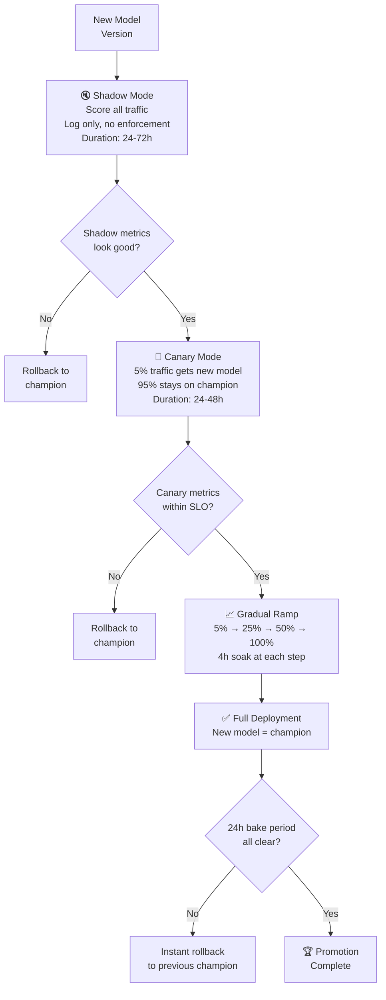
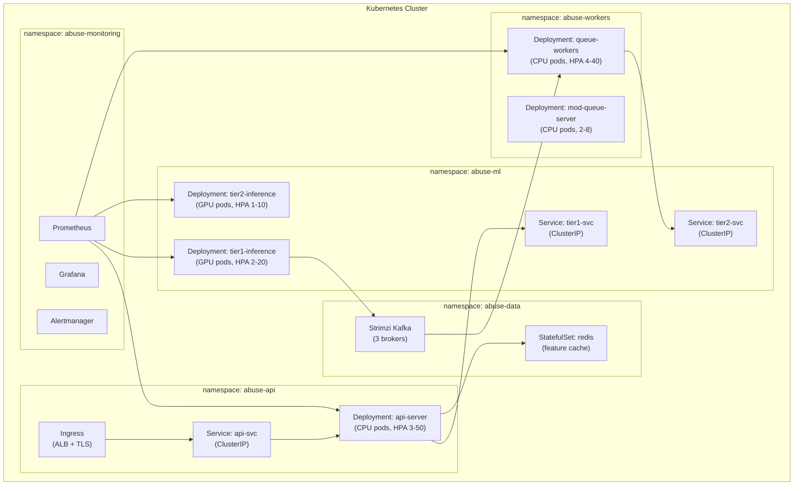
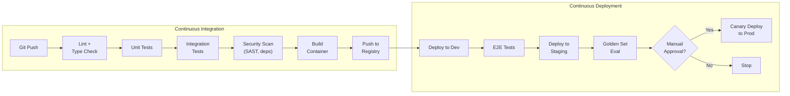
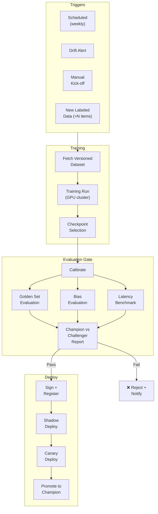
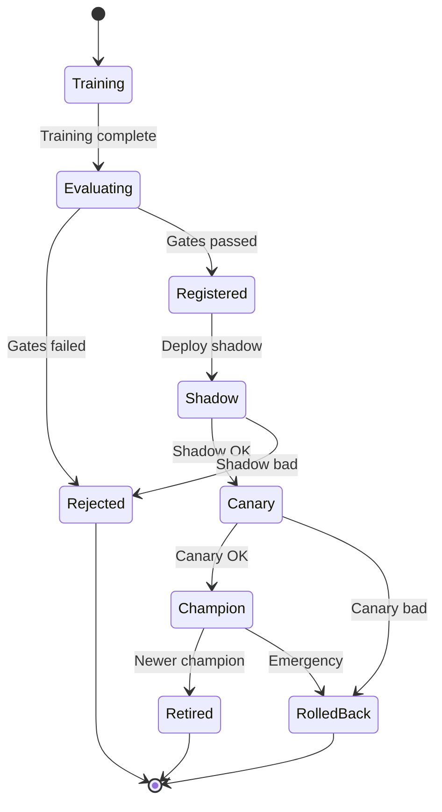
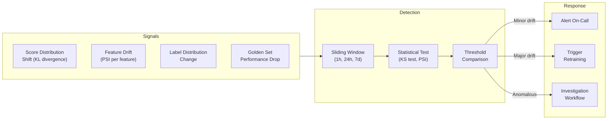
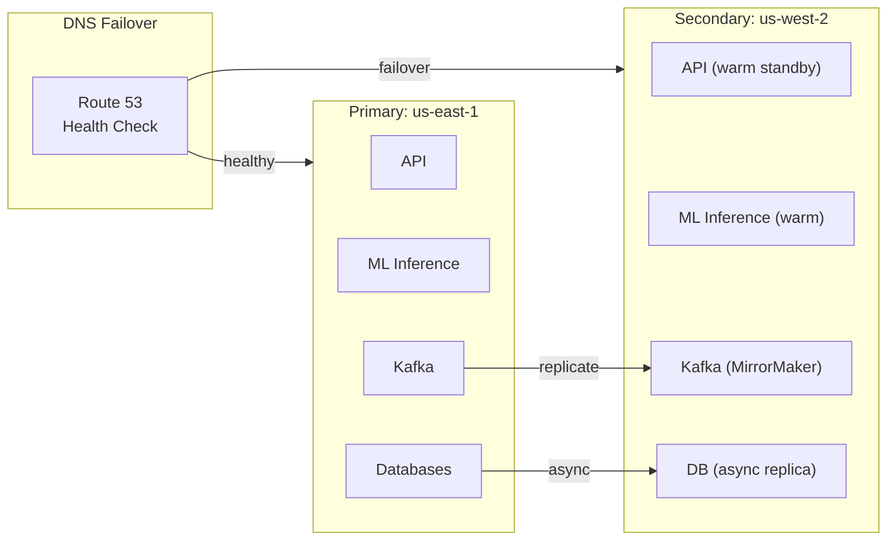

# Abuse Classifier System — Deployment & Operations Runbook

> **Version**: 1.0.0  
> **Status**: Draft  
> **Last Updated**: 2026-04-08

---

## Table of Contents

1. [Deployment Strategy](#1-deployment-strategy)
2. [Infrastructure as Code](#2-infrastructure-as-code)
3. [CI/CD Pipelines](#3-cicd-pipelines)
4. [Model Deployment Lifecycle](#4-model-deployment-lifecycle)
5. [Monitoring and Observability](#5-monitoring-and-observability)
6. [Alerting](#6-alerting)
7. [Incident Response Runbooks](#7-incident-response-runbooks)
8. [Capacity Planning](#8-capacity-planning)
9. [Disaster Recovery](#9-disaster-recovery)

---

## 1. Deployment Strategy

### 1.1 Environments

```
┌──────────┐    ┌──────────┐    ┌──────────┐    ┌──────────┐
│   Dev    │───▶│ Staging  │───▶│  Canary  │───▶│  Prod    │
│          │    │          │    │  (5%)    │    │ (100%)   │
│ Feature  │    │ Full     │    │ Real     │    │ Full     │
│ branches │    │ replica  │    │ traffic  │    │ traffic  │
│ + unit   │    │ + golden │    │ + shadow │    │ + SLOs   │
│ tests    │    │ set eval │    │ compare  │    │ active   │
└──────────┘    └──────────┘    └──────────┘    └──────────┘
```

### 1.2 Deployment Modes



### 1.3 Rollback Criteria (Automatic)

| Metric | Threshold for Auto-Rollback |
|--------|----------------------------|
| Error rate (5xx) | > 1% for 5 minutes |
| Latency p99 | > 300ms for 5 minutes |
| Block rate delta vs champion | > 15% relative change |
| CSAM recall (golden set probe) | Drops below 95% |
| Any class F1 (golden set probe) | Drops > 5 points |

---

## 2. Infrastructure as Code

### 2.1 Repository Structure

```
abuse-classifier-system/
├── infra/
│   ├── terraform/
│   │   ├── modules/
│   │   │   ├── api-gateway/
│   │   │   ├── inference-cluster/
│   │   │   ├── queue/
│   │   │   ├── storage/
│   │   │   ├── monitoring/
│   │   │   └── networking/
│   │   ├── environments/
│   │   │   ├── dev.tfvars
│   │   │   ├── staging.tfvars
│   │   │   └── prod.tfvars
│   │   └── main.tf
│   └── k8s/
│       ├── base/
│       │   ├── api-deployment.yaml
│       │   ├── inference-deployment.yaml
│       │   ├── worker-deployment.yaml
│       │   └── hpa.yaml
│       └── overlays/
│           ├── dev/
│           ├── staging/
│           └── prod/
├── src/
│   ├── api/
│   ├── inference/
│   ├── rules/
│   ├── features/
│   ├── fusion/
│   └── workers/
├── ml/
│   ├── training/
│   ├── evaluation/
│   ├── calibration/
│   └── export/
├── tests/
├── docs/
└── .github/workflows/
```

### 2.2 Kubernetes Resource Layout



---

## 3. CI/CD Pipelines

### 3.1 Application CI/CD



### 3.2 Model CI/CD (ML Pipeline)



---

## 4. Model Deployment Lifecycle

### 4.1 Model States



### 4.2 Model Serving Configuration

```yaml
# model-serving-config.yaml
models:
  tier1-text:
    champion:
      version: "v2.4.1"
      artifact: "s3://models/tier1-text/v2.4.1/model.onnx"
      checksum: "sha256:abc123..."
      max_batch_size: 32
      max_latency_ms: 25
      gpu_memory_mb: 2048
    challenger:
      version: "v2.5.0-rc1"
      artifact: "s3://models/tier1-text/v2.5.0-rc1/model.onnx"
      traffic_percent: 5
      mode: "canary"

  tier1-image:
    champion:
      version: "v1.2.0"
      artifact: "s3://models/tier1-image/v1.2.0/model.onnx"
      max_batch_size: 16
      max_latency_ms: 40
      gpu_memory_mb: 4096

  tier2-ensemble:
    champion:
      version: "v1.8.0"
      artifact: "s3://models/tier2-ensemble/v1.8.0/"
      max_batch_size: 8
      max_latency_ms: 500
      gpu_memory_mb: 16384

calibration:
  tier1-text:
    version: "cal-v2.4.1"
    artifact: "s3://models/calibration/tier1-text/cal-v2.4.1.pkl"
```

---

## 5. Monitoring and Observability

### 5.1 Monitoring Stack

```
┌─────────────────────────────────────────────────────────────────┐
│                     OBSERVABILITY STACK                           │
│                                                                 │
│  ┌───────────┐  ┌───────────┐  ┌───────────┐  ┌────────────┐  │
│  │ Metrics    │  │ Logs       │  │ Traces     │  │ ML Quality │  │
│  │ Prometheus │  │ ELK /      │  │ Jaeger /   │  │ Custom     │  │
│  │ + Grafana  │  │ CloudWatch │  │ Tempo      │  │ Dashboards │  │
│  │            │  │            │  │            │  │            │  │
│  │ • Latency  │  │ • Errors   │  │ • Request  │  │ • Scores   │  │
│  │ • RPS      │  │ • Audit    │  │   flow     │  │ • Drift    │  │
│  │ • Errors   │  │ • Debug    │  │ • Slow     │  │ • Fairness │  │
│  │ • GPU util │  │            │  │   queries  │  │ • Golden   │  │
│  └───────────┘  └───────────┘  └───────────┘  └────────────┘  │
│                                                                 │
│  ┌─────────────────────────────────────────────────────────┐   │
│  │                    Alertmanager                          │   │
│  │  PagerDuty / Opsgenie / Slack / Email                   │   │
│  └─────────────────────────────────────────────────────────┘   │
└─────────────────────────────────────────────────────────────────┘
```

### 5.2 Dashboard Hierarchy

```
DASHBOARDS
├── L0: Executive Summary
│   ├── Total items classified (24h)
│   ├── Block rate by class
│   ├── Appeal overturn rate
│   └── System availability
│
├── L1: Operational Health
│   ├── Latency (p50, p95, p99) by endpoint
│   ├── Error rates (4xx, 5xx)
│   ├── Queue depth and lag
│   ├── GPU utilization
│   └── Human review SLA compliance
│
├── L2: Model Quality
│   ├── Score distributions (histogram per class)
│   ├── Golden set probe results (live)
│   ├── Champion vs challenger comparison
│   ├── Calibration plots
│   └── Feature drift indicators
│
├── L3: Fairness & Safety
│   ├── FPR by language / dialect
│   ├── Block rate by user cohort
│   ├── CSAM pipeline metrics
│   └── Escalation rates
│
└── L4: Data & Pipeline
    ├── Labeling throughput
    ├── Active learning queue size
    ├── Training pipeline status
    └── Data freshness
```

### 5.3 Key Metrics

| Category | Metric | Prometheus Name | Labels |
|----------|--------|-----------------|--------|
| Latency | Request duration | `classifier_request_duration_seconds` | `endpoint`, `tier`, `status` |
| Throughput | Requests per second | `classifier_requests_total` | `endpoint`, `action`, `class` |
| Errors | Error count | `classifier_errors_total` | `endpoint`, `error_code` |
| ML | Score distribution | `classifier_score` (histogram) | `class`, `model_version` |
| ML | Block rate | `classifier_action_total` | `action`, `class` |
| ML | Golden set result | `classifier_golden_set_metric` | `class`, `metric_type` |
| Queue | Depth | `classifier_queue_depth` | `queue_name`, `priority` |
| Queue | Consumer lag | `classifier_consumer_lag` | `queue_name` |
| GPU | Utilization | `classifier_gpu_utilization_percent` | `pod`, `gpu_id` |
| Human | Queue depth | `classifier_human_queue_depth` | `language`, `severity` |
| Human | Review latency | `classifier_human_review_duration_seconds` | `reviewer`, `class` |

### 5.4 Drift Detection



---

## 6. Alerting

### 6.1 Alert Severity Matrix

| Severity | Response Time | Channel | Example |
|----------|-------------|---------|---------|
| **P0 (Critical)** | < 15 min | PagerDuty + Phone | System down, CSAM pipeline failure |
| **P1 (High)** | < 1 hour | PagerDuty + Slack | Latency SLO breach, error rate > 1% |
| **P2 (Medium)** | < 4 hours | Slack #abuse-alerts | Drift detected, queue SLA at risk |
| **P3 (Low)** | Next business day | Email + Slack | Golden set minor regression, rater drift |

### 6.2 Critical Alerts

```yaml
# alerting-rules.yaml (Prometheus format)
groups:
  - name: abuse-classifier-critical
    rules:
      - alert: HighErrorRate
        expr: |
          rate(classifier_errors_total{status="5xx"}[5m])
          / rate(classifier_requests_total[5m]) > 0.01
        for: 5m
        labels:
          severity: P1
        annotations:
          summary: "Error rate > 1% for 5 minutes"
          runbook: "docs/runbooks/high-error-rate.md"

      - alert: LatencySLOBreach
        expr: |
          histogram_quantile(0.99,
            rate(classifier_request_duration_seconds_bucket[5m])
          ) > 0.3
        for: 5m
        labels:
          severity: P1
        annotations:
          summary: "p99 latency > 300ms"
          runbook: "docs/runbooks/high-latency.md"

      - alert: CSAMPipelineDown
        expr: |
          up{job="csam-hash-pipeline"} == 0
        for: 1m
        labels:
          severity: P0
        annotations:
          summary: "CSAM hash pipeline is down"
          runbook: "docs/runbooks/csam-pipeline-down.md"

      - alert: ModelDriftDetected
        expr: |
          classifier_golden_set_metric{metric_type="f1"}
          < classifier_golden_set_baseline * 0.95
        for: 30m
        labels:
          severity: P2
        annotations:
          summary: "Golden set F1 dropped > 5% from baseline"
          runbook: "docs/runbooks/model-drift.md"

      - alert: QueueBacklogCritical
        expr: |
          classifier_consumer_lag{queue_name="tier2-scoring"} > 10000
        for: 10m
        labels:
          severity: P1
        annotations:
          summary: "Tier-2 queue backlog > 10K items"
          runbook: "docs/runbooks/queue-backlog.md"
```

---

## 7. Incident Response Runbooks

### 7.1 Runbook: High Error Rate (> 1%)

```
RUNBOOK: HIGH ERROR RATE
════════════════════════

SEVERITY: P1
SLO: Error rate < 0.1%
ESCALATION: On-call SRE → ML Engineering → T&S Lead

STEPS:

1. ASSESS
   □ Check Grafana L1 dashboard: which endpoints are erroring?
   □ Check error logs: what error codes / stack traces?
   □ Is it correlated with a recent deployment?

2. MITIGATE (choose one)
   □ If bad deployment → rollback:
     kubectl rollout undo deployment/api-server -n abuse-api
   □ If model OOM → restart inference pods:
     kubectl rollout restart deployment/tier1-inference -n abuse-ml
   □ If dependency failure → enable degraded mode:
     curl -X POST http://config-service/v1/mode -d '{"mode":"rules_only"}'
   □ If unknown → increase replicas to buy time:
     kubectl scale deployment/api-server --replicas=20 -n abuse-api

3. VERIFY
   □ Error rate returning to < 0.1%?
   □ Latency within SLO?
   □ No increase in missed abuse (check golden probes)?

4. POST-INCIDENT
   □ Write incident report within 48h
   □ Update runbook if new failure mode discovered
```

### 7.2 Runbook: Model Drift Detected

```
RUNBOOK: MODEL DRIFT
════════════════════

SEVERITY: P2
ESCALATION: ML Engineering → T&S Policy

STEPS:

1. DIAGNOSE
   □ Which classes are drifting? Check per-class golden metrics
   □ Check score distribution histograms: shift direction?
   □ Check feature drift (PSI): which features changed?
   □ Check for upstream data changes (new content types, languages)
   □ Check for adversarial campaigns (sudden pattern shift)

2. SHORT-TERM MITIGATION
   □ Tighten thresholds for affected classes (route more to human)
   □ Add emergency rules for new patterns
   □ If severe: rollback to previous model version

3. LONG-TERM FIX
   □ Trigger active learning sampling for drifted region
   □ Label new samples
   □ Retrain model with updated data
   □ Follow standard deployment lifecycle (shadow → canary → full)

4. VERIFY
   □ Golden set metrics restored?
   □ Score distributions stabilized?
   □ No regression in other classes?
```

### 7.3 Runbook: CSAM Pipeline Failure

```
RUNBOOK: CSAM PIPELINE DOWN
════════════════════════════

SEVERITY: P0 (HIGHEST PRIORITY)
ESCALATION: IMMEDIATE → SRE Lead + Legal + T&S Director

⚠️  LEGAL OBLIGATION: CSAM detection must not have extended downtime.

STEPS:

1. IMMEDIATE (within 5 minutes)
   □ Page SRE lead and T&S director
   □ Enable CSAM fail-closed mode:
     - ALL media uploads queued for manual review
     - No media is served until hash-checked
   □ Check hash DB connectivity
   □ Check PhotoDNA / NCMEC API status

2. RESTORE
   □ If hash DB down → failover to replica
   □ If API down → switch to backup provider
   □ If network → engage networking on-call

3. VERIFY
   □ Hash pipeline processing again?
   □ Backlog of unscanned media cleared?
   □ No media was served without scanning?

4. POST-INCIDENT
   □ Mandatory incident report within 24h
   □ Legal team notified of any gap in coverage
   □ Review and improve redundancy
```

---

## 8. Capacity Planning

### 8.1 Sizing Model

```
CAPACITY PLANNING FORMULA
══════════════════════════

Target: 50,000 RPS (sync), 5,000 RPS (async)

API Pods (CPU):
  Throughput per pod: ~2,000 RPS
  Pods needed: ceil(50,000 / 2,000) × 1.5 (headroom) = 38 pods
  With 3 AZs: ~13 pods per AZ

Tier-1 GPU Pods:
  Throughput per GPU (A10G, batch=16): ~3,000 items/sec
  GPUs needed: ceil(50,000 / 3,000) × 1.5 = 25 GPUs
  With 3 AZs: ~9 GPUs per AZ

Tier-2 GPU Pods:
  Throughput per GPU (A100, batch=8): ~200 items/sec
  Queue rate (10% of traffic): 5,000 RPS
  GPUs needed: ceil(5,000 / 200) × 1.5 = 38 GPUs

Queue Workers (CPU):
  Throughput per worker: ~500 items/sec
  Workers needed: ceil(5,000 / 500) × 1.5 = 15 workers

Redis (Feature Cache):
  Hit rate target: 70%
  Memory: ~100GB (hot features)
  Nodes: 3 (one per AZ, replicated)
```

### 8.2 Cost Estimate (Monthly)

```
┌────────────────────────┬────────────┬──────────┬──────────┐
│ Component              │ Instances  │ Unit Cost│ Monthly  │
├────────────────────────┼────────────┼──────────┼──────────┤
│ API Pods (c6i.2xl)     │ 38         │ $250     │ $9,500   │
│ Tier-1 GPU (g5.xl)     │ 25         │ $800     │ $20,000  │
│ Tier-2 GPU (p4d.24xl)  │ 5          │ $25,000  │ $125,000 │
│ Queue Workers (c6i.xl) │ 15         │ $125     │ $1,875   │
│ Redis (r6g.2xl)        │ 3          │ $400     │ $1,200   │
│ Kafka (m6i.2xl)        │ 3          │ $300     │ $900     │
│ S3 Storage (10TB)      │ —          │ —        │ $230     │
│ Data Transfer           │ —          │ —        │ $5,000   │
│ Monitoring             │ —          │ —        │ $2,000   │
├────────────────────────┼────────────┼──────────┼──────────┤
│ TOTAL INFRASTRUCTURE   │            │          │ ~$166K   │
├────────────────────────┼────────────┼──────────┼──────────┤
│ Human Reviewers (50)   │ 50 FTE     │ $4,000   │ $200,000 │
│ ML Team (10)           │ 10 FTE     │ $15,000  │ $150,000 │
├────────────────────────┼────────────┼──────────┼──────────┤
│ TOTAL (infra + people) │            │          │ ~$516K   │
└────────────────────────┴────────────┴──────────┴──────────┘
```

---

## 9. Disaster Recovery

### 9.1 RPO / RTO Targets

| Component | RPO (data loss) | RTO (recovery time) |
|-----------|----------------|---------------------|
| API service | N/A (stateless) | < 5 minutes |
| Model serving | N/A (artifacts in S3) | < 10 minutes |
| Decision audit log | 0 (no data loss) | < 1 hour |
| Queue (Kafka) | < 1 minute | < 15 minutes |
| Feature store (Redis) | < 5 minutes | < 10 minutes |
| Label database | 0 (no data loss) | < 30 minutes |

### 9.2 Multi-Region Failover



### 9.3 Backup Schedule

| Data | Frequency | Retention | Location |
|------|-----------|-----------|----------|
| Model artifacts | On registration | Forever | S3 (versioned, cross-region) |
| Audit logs | Continuous (streaming) | 7 years | S3 Glacier (compliance) |
| Decision database | Hourly snapshot | 90 days | RDS automated backup |
| Label database | Daily snapshot | 1 year | RDS + S3 export |
| Configuration | On change (GitOps) | Git history | Git repository |
| Kafka topics | 7 day retention | 7 days | Kafka + S3 archive |

---

*Next: [05-TAXONOMY-AND-POLICY.md](./05-TAXONOMY-AND-POLICY.md) — Abuse taxonomy, policy definitions, governance*
