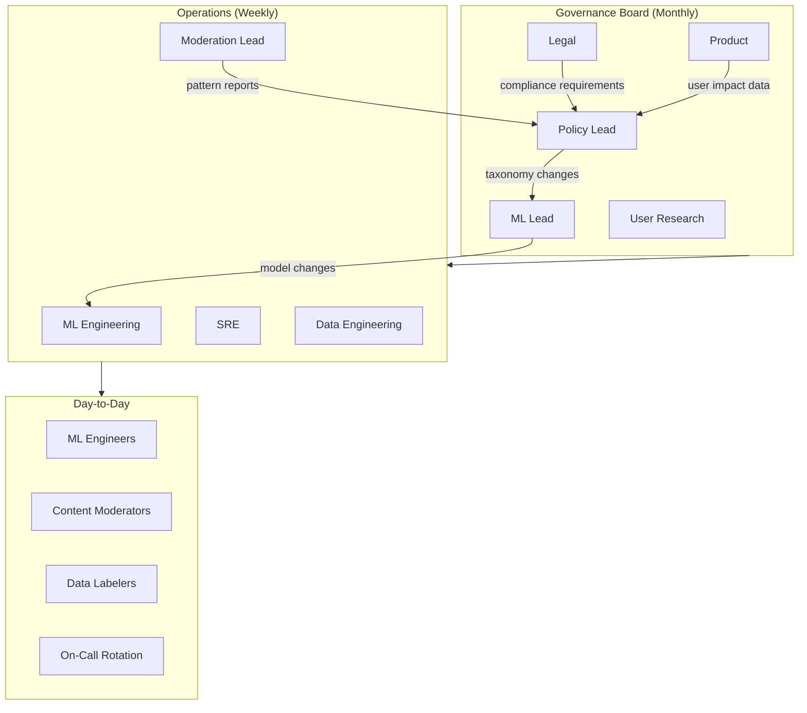
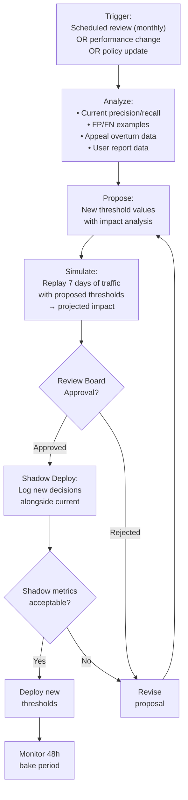
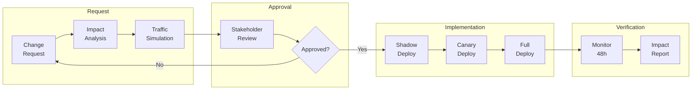

# Abuse Classifier System — Taxonomy, Policy & Governance

> **Version**: 1.0.0  
> **Status**: Draft  
> **Last Updated**: 2026-04-08

---

## Table of Contents

1. [Governance Model](#1-governance-model)
2. [Full Abuse Taxonomy](#2-full-abuse-taxonomy)
3. [Class Definitions and Examples](#3-class-definitions-and-examples)
4. [Threshold Management](#4-threshold-management)
5. [Change Management](#5-change-management)
6. [Legal and Regulatory Compliance](#6-legal-and-regulatory-compliance)
7. [Ethical Guidelines](#7-ethical-guidelines)
8. [Glossary](#8-glossary)

---

## 1. Governance Model

### 1.1 Stakeholder Map



### 1.2 Decision Authority Matrix (RACI)

| Decision | Responsible | Accountable | Consulted | Informed |
|----------|-------------|-------------|-----------|----------|
| Add/remove abuse class | Policy Lead | Governance Board | ML, Legal, Product | All |
| Change thresholds | ML Lead | Policy Lead | SRE, Moderation | All |
| Deploy new model | ML Engineering | ML Lead | Policy, SRE | All |
| Emergency rule | On-Call SRE | ML Lead | Policy | All |
| Rollback model | On-Call SRE | ML Lead | Policy | All |
| Labeling guidelines update | Policy Lead | Governance Board | ML, Moderation | Labelers |
| Appeal policy change | Policy Lead | Legal | Product, UX | Moderation |

---

## 2. Full Abuse Taxonomy

### 2.1 Taxonomy Tree

```
ABUSE TAXONOMY v3.0
│
├── 1. HATE_SPEECH
│   ├── 1.1 hate_race_ethnicity
│   │   ├── Slurs and dehumanizing language
│   │   ├── Supremacist ideology
│   │   └── Stereotyping with intent to demean
│   ├── 1.2 hate_gender_sex
│   │   ├── Misogyny / misandry
│   │   └── Gender-based dehumanization
│   ├── 1.3 hate_religion
│   │   ├── Anti-religious slurs
│   │   └── Religious group dehumanization
│   ├── 1.4 hate_disability
│   │   ├── Ableist slurs
│   │   └── Mockery of disability
│   ├── 1.5 hate_sexual_orientation
│   │   ├── Homophobic / transphobic slurs
│   │   └── Conversion ideology promotion
│   └── 1.6 hate_other
│       └── Hate based on other protected characteristics
│
├── 2. VIOLENCE
│   ├── 2.1 violence_threat_direct
│   │   └── Specific, credible threat to an identifiable target
│   ├── 2.2 violence_threat_indirect
│   │   └── Veiled or conditional threats
│   ├── 2.3 violence_glorification
│   │   └── Praising or celebrating violent acts
│   └── 2.4 violence_graphic_content
│       └── Graphic depictions of violence (text or media)
│
├── 3. HARASSMENT
│   ├── 3.1 harassment_targeted
│   │   └── Sustained unwanted contact targeting an individual
│   ├── 3.2 harassment_bullying
│   │   └── Intimidation, ridicule, or social exclusion
│   └── 3.3 harassment_doxxing
│       └── Sharing private information without consent
│
├── 4. SEXUAL_CONTENT
│   ├── 4.1 sexual_explicit
│   │   └── Sexually explicit material (where prohibited)
│   ├── 4.2 sexual_solicitation
│   │   └── Unwanted sexual advances
│   └── 4.3 csam_adjacent ⚠️ ESCALATION REQUIRED
│       └── Any content depicting or sexualizing minors
│
├── 5. SELF_HARM
│   ├── 5.1 self_harm_ideation
│   │   └── Expressing intent or desire for self-harm
│   ├── 5.2 self_harm_instructions
│   │   └── Providing methods or instructions
│   └── 5.3 self_harm_glorification
│       └── Glorifying or normalizing self-harm / suicide
│
├── 6. SPAM_SCAM
│   ├── 6.1 spam_commercial
│   │   └── Unsolicited commercial promotion
│   ├── 6.2 spam_engagement
│   │   └── Artificial engagement (follow-for-follow, etc.)
│   ├── 6.3 scam_financial
│   │   └── Financial fraud, fake investment schemes
│   └── 6.4 scam_phishing
│       └── Credential harvesting, impersonation for data theft
│
├── 7. MISINFORMATION
│   ├── 7.1 misinfo_health
│   │   └── Dangerous health misinformation
│   ├── 7.2 misinfo_political
│   │   └── Election interference, voter suppression
│   └── 7.3 misinfo_dangerous
│       └── Misinformation likely to cause physical harm
│
└── 8. POLICY_SPECIFIC
    ├── 8.1 impersonation
    │   └── Pretending to be another person or entity
    ├── 8.2 copyright_claim
    │   └── Unauthorized use of copyrighted material
    └── 8.3 platform_manipulation
        └── Coordinated inauthentic behavior, bot networks
```

### 2.2 Multi-Label Rules

```
MULTI-LABEL POLICY:
═══════════════════

• Content CAN have multiple labels (e.g., hate + violence)
• Action is determined by the MOST SEVERE applicable class
• Severity precedence (highest to lowest):
  1. csam_adjacent (always P0)
  2. violence_threat_direct
  3. self_harm_instructions
  4. All other classes (use score-based fusion)

• OVERLAP RESOLUTION:
  - hate + violence → label both; action = max(severity)
  - spam + hate → label both; prioritize hate for action
  - self_harm_ideation alone → may route to support resources
    rather than enforcement
```

---

## 3. Class Definitions and Examples

### 3.1 Hate Speech

```
CLASS: HATE_SPEECH
══════════════════

DEFINITION:
  Content that attacks, demeans, or incites violence against
  individuals or groups based on protected characteristics
  (race, ethnicity, gender, religion, disability, sexual
  orientation, national origin).

INCLUDES:
  ✓ Slurs used with derogatory intent
  ✓ Dehumanizing comparisons (e.g., comparing groups to animals)
  ✓ Calls for exclusion, segregation, or harm based on identity
  ✓ Supremacist ideology or propaganda
  ✓ Stereotyping with clear intent to demean

EXCLUDES:
  ✗ Academic or journalistic discussion of hate speech
  ✗ Self-referential use of reclaimed terms within community
  ✗ Criticism of beliefs or ideas (vs. people)
  ✗ Political disagreement without targeting identity
  ✗ Reporting or quoting hate speech for condemnation

EDGE CASES:
  ⚠ Coded language / dog whistles → context-dependent; may
    require Tier-2 or human review
  ⚠ Satire / irony → evaluate whether a reasonable person
    would interpret as hateful
  ⚠ Song lyrics / movie quotes → context of use matters
```

### 3.2 Violence

```
CLASS: VIOLENCE
═══════════════

DEFINITION:
  Content that threatens, glorifies, or graphically depicts
  violence against people or animals.

SUBCLASS DISTINCTIONS:

  violence_threat_direct:
    "I know where you live, I'm coming for you tonight"
    → Specific target, specific action, credible

  violence_threat_indirect:
    "People like you deserve what's coming"
    → Implied threat, ambiguous target or timeline

  violence_glorification:
    "That attack was epic, wish I could have been there"
    → Celebrating or praising violent acts

  violence_graphic_content:
    Detailed descriptions or imagery of injury, torture, death
    → Graphic without clear journalistic or educational purpose
```

### 3.3 CSAM-Adjacent (Special Handling)

```
CLASS: CSAM_ADJACENT
════════════════════

⚠️  THIS CLASS HAS SPECIAL LEGAL AND ETHICAL REQUIREMENTS  ⚠️

DEFINITION:
  Any content that depicts, describes, solicits, or sexualizes
  minors (individuals under 18).

MANDATORY PROCEDURES:
  1. Threshold is EXTREMELY LOW (queue at 0.01, block at 0.50)
  2. ALL flagged content goes to mandatory human review
  3. Confirmed CSAM → immediate LE report (NCMEC / equivalent)
  4. Content is NEVER served back to any user while under review
  5. Reviewers are specially trained and provided with wellbeing support
  6. Hash of confirmed material added to blocklist (PhotoDNA)
  7. Audit trail is legally mandated and must be preserved

DO NOT:
  ✗ Ever return confirmed CSAM content in API responses
  ✗ Store CSAM longer than legally required
  ✗ Allow engineers to access CSAM outside of authorized investigation
  ✗ Rely solely on ML for CSAM detection (hash matching is primary)
```

---

## 4. Threshold Management

### 4.1 Threshold Tuning Process



### 4.2 Current Thresholds (Reference)

```
OPERATING THRESHOLDS v3.0 (2026-04-01)
═══════════════════════════════════════

                     SOFT     QUEUE    BLOCK
CLASS               LIMIT   (HUMAN)   (AUTO)   NOTES
─────────────────── ──────  ────────  ──────── ──────────────────
hate_speech          0.30     0.55     0.80    
violence_direct      0.20     0.45     0.70    Lower = safer
violence_indirect    0.30     0.55     0.80    
violence_glorify     0.25     0.50     0.75    
harassment           0.35     0.60     0.82    
sexual_explicit      0.25     0.50     0.75    
csam_adjacent        —        0.01     0.50    Always queue ≥0.01
self_harm_ideation   0.20     0.40     0.65    May route to support
self_harm_instruct   0.15     0.35     0.60    
spam_commercial      0.45     0.65     0.88    
scam_financial       0.30     0.50     0.75    
misinformation       0.40     0.60     0.85    Higher FP tolerance

SPECIAL RULES:
• severity ≥ 3 AND any class ≥ queue threshold → mandatory human
• account_age < 1 day → thresholds lowered by 10%
• repeat offender (≥ 2 violations in 30d) → thresholds lowered by 15%
```

---

## 5. Change Management

### 5.1 Change Types and Approval

| Change Type | Examples | Approval Required | Lead Time |
|-------------|---------|-------------------|-----------|
| **Emergency rule** | New viral abuse pattern | On-call + ML Lead | Immediate |
| **Threshold adjustment** | Tuning precision/recall | ML Lead + Policy | 48h (shadow) |
| **New abuse class** | Adding "deepfake" | Governance Board | 4-6 weeks |
| **Remove abuse class** | Merging sub-classes | Governance Board | 2-4 weeks |
| **Model deployment** | New model version | ML Lead + eval gate | 3-7 days |
| **Guideline update** | Clarifying edge cases | Policy Lead | 1 week |

### 5.2 Change Request Flow



---

## 6. Legal and Regulatory Compliance

### 6.1 Regulatory Landscape

```
┌─────────────────────────────────────────────────────────────┐
│                REGULATORY REQUIREMENTS                       │
│                                                             │
│  ┌──────────────────────────────────────────────────────┐   │
│  │  GLOBAL                                              │   │
│  │  • CSAM: NCMEC reporting (US), IWF (UK), INHOPE      │   │
│  │  • Terrorist content: GIFCT hash sharing              │   │
│  └──────────────────────────────────────────────────────┘   │
│                                                             │
│  ┌──────────────────────────────────────────────────────┐   │
│  │  EU                                                  │   │
│  │  • Digital Services Act (DSA): transparency reports,  │   │
│  │    appeal rights, systemic risk assessments           │   │
│  │  • GDPR: data minimization, right to explanation      │   │
│  │  • Terrorist Content Regulation: 1h removal SLA       │   │
│  └──────────────────────────────────────────────────────┘   │
│                                                             │
│  ┌──────────────────────────────────────────────────────┐   │
│  │  US                                                  │   │
│  │  • 18 U.S.C. § 2258A: CSAM mandatory reporting       │   │
│  │  • Section 230: safe harbor (with limitations)        │   │
│  └──────────────────────────────────────────────────────┘   │
│                                                             │
│  ┌──────────────────────────────────────────────────────┐   │
│  │  OTHER                                               │   │
│  │  • UK Online Safety Act                              │   │
│  │  • India IT Rules 2021                               │   │
│  │  • Australia Online Safety Act                        │   │
│  │  • Brazil Marco Civil                                │   │
│  └──────────────────────────────────────────────────────┘   │
└─────────────────────────────────────────────────────────────┘
```

### 6.2 Compliance Checklist

| Requirement | Implementation | Status |
|-------------|---------------|--------|
| CSAM mandatory reporting | Auto-report pipeline to NCMEC | Required |
| DSA transparency report | Automated quarterly reporting | Required (EU) |
| User appeal right | API + UI appeal flow, SLA-bound | Required (EU) |
| Right to explanation | Model rationale in decisions | Required (EU) |
| Data retention limits | TTL on content, audit log archival | Required |
| Terrorist content 1h SLA | Priority queue + on-call reviewer | Required (EU) |
| Accessibility of T&C | Public policy documentation | Required |
| Annual risk assessment | Governance board process | Required (DSA) |

---

## 7. Ethical Guidelines

### 7.1 Principles

```
ETHICAL PRINCIPLES
══════════════════

1. PROPORTIONALITY
   Actions should be proportionate to the severity of the violation.
   Prefer less restrictive actions when possible (warning > removal > ban).

2. TRANSPARENCY
   Users should understand why content was actioned.
   Model decisions should be explainable, not opaque.

3. FAIRNESS
   The system must not disproportionately impact protected groups.
   Regular bias audits are mandatory, not optional.

4. APPEAL RIGHTS
   Every automated decision must be appealable by a human.
   Appeal outcomes feed back into system improvement.

5. HUMAN DIGNITY
   Content moderators must have access to wellbeing support.
   Exposure to harmful content is minimized through tooling.

6. PRIVACY
   Collect minimum data necessary for abuse detection.
   PII is pseudonymized wherever possible.
   Surveillance-like features (behavioral profiling) require
   explicit governance approval.

7. ACCOUNTABILITY
   Every decision is auditable and traceable.
   Ownership and responsibility are clearly defined.
```

### 7.2 Reviewer Wellbeing

```
REVIEWER WELLBEING PROGRAM
══════════════════════════

REQUIRED:
□ Maximum 4 hours/day reviewing graphic content
□ Mandatory 15-min break every 90 minutes
□ Free, confidential counseling (24/7 EAP)
□ Quarterly wellness check-ins
□ Opt-out from specific content categories (reassign)
□ Blurred/redacted previews by default (click-to-reveal)
□ Rotation across severity levels

TOOLING SUPPORT:
□ Auto-blur graphic media in review UI
□ Grayscale mode for graphic imagery
□ Resilience training resources
□ Peer support groups
```

---

## 8. Glossary

| Term | Definition |
|------|-----------|
| **Abuse class** | A category in the abuse taxonomy (e.g., hate speech, violence) |
| **Active learning** | Sampling strategy that prioritizes uncertain/borderline examples for labeling |
| **Calibration** | Post-training adjustment so model scores represent true probabilities |
| **Champion model** | The currently deployed production model |
| **Challenger model** | A candidate model being evaluated against the champion |
| **CSAM** | Child Sexual Abuse Material |
| **Decision fusion** | Aggregating scores from multiple signals into a single routing decision |
| **Deobfuscation** | Reversing text manipulations (l33t speak, zero-width chars) to normalize content |
| **DSA** | Digital Services Act (EU regulation) |
| **ECE** | Expected Calibration Error — measures how well model probabilities match reality |
| **Golden set** | A curated, stable evaluation dataset with high-quality labels |
| **IWF** | Internet Watch Foundation (UK CSAM reporting body) |
| **Model card** | Standardized documentation of a model's purpose, performance, and limitations |
| **NCMEC** | National Center for Missing & Exploited Children (US CSAM reporting body) |
| **NSFW** | Not Safe For Work — general term for adult content |
| **OPA** | Open Policy Agent — declarative policy engine |
| **PhotoDNA** | Microsoft's perceptual hashing technology for known-image matching |
| **PSI** | Population Stability Index — measures distribution shift between datasets |
| **RACI** | Responsible, Accountable, Consulted, Informed — decision authority matrix |
| **Shadow mode** | Running a new model in parallel without affecting production decisions |
| **Soft limit** | A non-blocking enforcement (e.g., rate limit, friction, warning) |
| **Tier-1** | Fast synchronous ML scoring (< 20ms) |
| **Tier-2** | Deeper asynchronous ML scoring (< 500ms) |
| **Threshold** | Score cutoff that determines the enforcement action |

---

*End of documentation suite. See also:*
- *[01-ARCHITECTURE.md](./01-ARCHITECTURE.md) — System architecture and flow diagrams*
- *[02-API-SPECIFICATION.md](./02-API-SPECIFICATION.md) — API contracts and schemas*
- *[03-DATA-AND-TRAINING.md](./03-DATA-AND-TRAINING.md) — Data pipelines and model training*
- *[04-DEPLOYMENT-AND-OPERATIONS.md](./04-DEPLOYMENT-AND-OPERATIONS.md) — Deployment and runbooks*
