# Abuse Classifier System — Architecture Document

> **Version**: 1.0.0  
> **Status**: Draft  
> **Last Updated**: 2026-04-08  
> **Owner**: Platform Trust & Safety Engineering

---

## Table of Contents

1. [Executive Summary](#1-executive-summary)
2. [System Overview](#2-system-overview)
3. [High-Level Architecture](#3-high-level-architecture)
4. [Request Lifecycle](#4-request-lifecycle)
5. [Component Deep Dives](#5-component-deep-dives)
6. [Data Flow Diagrams](#6-data-flow-diagrams)
7. [Decision Engine](#7-decision-engine)
8. [Scalability and Performance](#8-scalability-and-performance)
9. [Failure Modes and Resilience](#9-failure-modes-and-resilience)
10. [Security and Compliance](#10-security-and-compliance)
11. [Technology Choices](#11-technology-choices)

---

## 1. Executive Summary

This document describes the architecture for a **production-grade abuse classification system** capable of detecting and acting on abusive user-generated content (text, images, video, metadata) at scale. The system is designed around four principles:

- **Tiered intelligence** — cheap rules first, ML second, humans last.
- **Calibrated confidence** — every decision carries a probability, not a boolean.
- **Safe iteration** — shadow mode, champion–challenger, automatic rollback.
- **Auditability** — every action is traceable for appeals, compliance, and retraining.

---

## 2. System Overview

```
┌──────────────────────────────────────────────────────────────────┐
│                      ABUSE CLASSIFIER PLATFORM                   │
│                                                                  │
│  ┌────────────┐  ┌────────────┐  ┌────────────┐  ┌───────────┐   │
│  │  Ingestion │→ │  Scoring   │→ │  Decision  │→ │  Action   │   │
│  │  & Routing │  │  Pipeline  │  │  Fusion    │  │  Engine   │   │
│  └────────────┘  └────────────┘  └────────────┘  └───────────┘   │
│         ↑               ↑               ↑              ↓         │
│  ┌──────┴───────────────┴───────────────┴──────────────┴──────┐  │
│  │              Observability · MLOps · Governance            │  │
│  └────────────────────────────────────────────────────────────┘  │
└──────────────────────────────────────────────────────────────────┘
```

---

## 3. High-Level Architecture

### 3.1 Full System Diagram

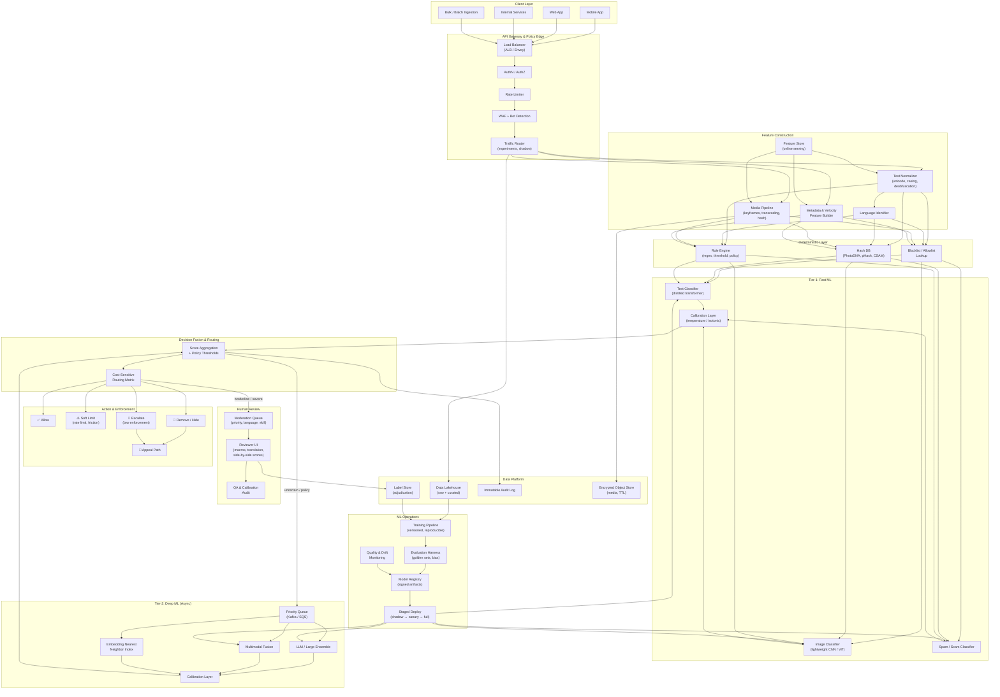

### 3.2 Simplified Flow (4-Stage Pipeline)

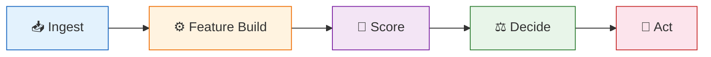

---

## 4. Request Lifecycle

### 4.1 Synchronous Path (< p99 200ms target)

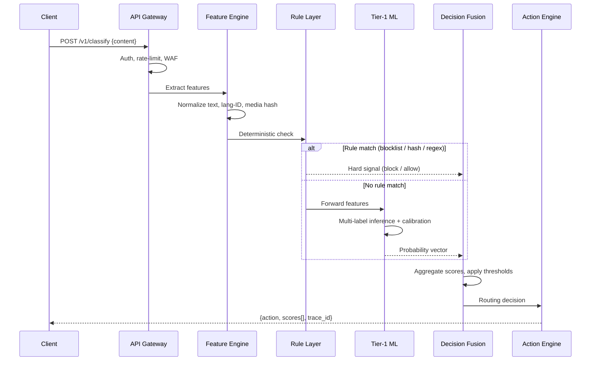

### 4.2 Asynchronous Path (Tier-2 / Human)

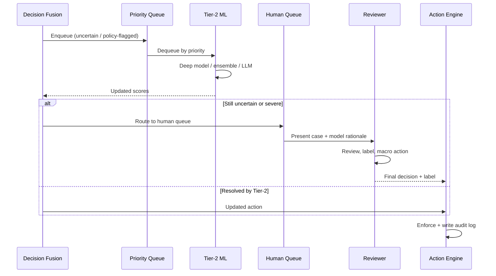

---

## 5. Component Deep Dives

### 5.1 API Gateway & Policy Edge

```
┌─────────────────────────────────────────────────────────────┐
│                        API GATEWAY                           │
│                                                             │
│  ┌──────────┐  ┌──────────┐  ┌──────────┐  ┌────────────┐  │
│  │   Auth    │→│   Rate    │→│   WAF     │→│  Experiment │  │
│  │  (JWT/    │  │  Limiter  │  │  + Bot   │  │   Router   │  │
│  │  mTLS)    │  │  (sliding │  │  Detect  │  │  (shadow,  │  │
│  │          │  │  window)  │  │          │  │  canary)   │  │
│  └──────────┘  └──────────┘  └──────────┘  └────────────┘  │
└─────────────────────────────────────────────────────────────┘
```

| Responsibility | Detail |
|---|---|
| **Authentication** | mTLS for service-to-service; JWT/OAuth2 for external clients |
| **Rate limiting** | Per-tenant sliding window; burst allowance; adaptive under load |
| **WAF** | Block known attack patterns targeting the classifier itself |
| **Experiment router** | Shadow scoring (log but don't act), canary (small % live), A/B |

### 5.2 Feature Construction

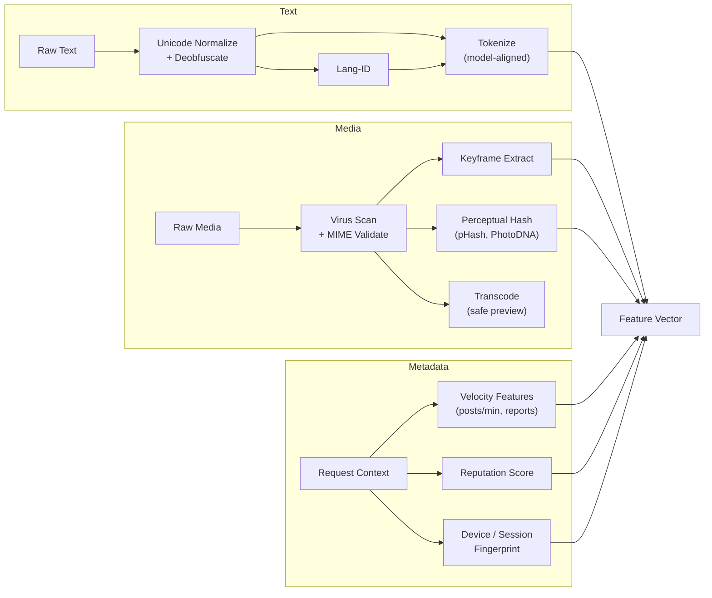

### 5.3 Scoring Pipeline (Tiered)

```
                    ┌─────────────────────┐
                    │   Incoming Features  │
                    └─────────┬───────────┘
                              │
                    ┌─────────▼───────────┐
              ┌─────│  Deterministic Rules │─────┐
              │     │  (blocklist, hash,   │     │
              │     │   regex, hard policy)│     │
              │     └─────────┬───────────┘     │
         HARD BLOCK      NO MATCH          HARD ALLOW
              │              │                   │
              │     ┌────────▼────────┐          │
              │     │  Tier-1: Fast ML │          │
              │     │  (< 20ms, GPU)   │          │
              │     │  multi-label +   │          │
              │     │  calibration     │          │
              │     └────────┬────────┘          │
              │              │                   │
              │     ┌────────▼────────┐          │
              │     │  Decision Fusion │◄─────────┘
              │     │  (score agg +    │
              │     │   thresholds)    │
              │     └──┬─────┬────┬───┘
              │        │     │    │
         ┌────▼──┐  ┌──▼──┐ │ ┌──▼──────────┐
         │ Block │  │Allow│ │ │ Queue: Tier-2│
         └───────┘  └─────┘ │ │ (async, deep │
                             │ │  models)     │
                             │ └──────────────┘
                        ┌────▼─────────┐
                        │ Human Review │
                        └──────────────┘
```

### 5.4 Decision Fusion Logic

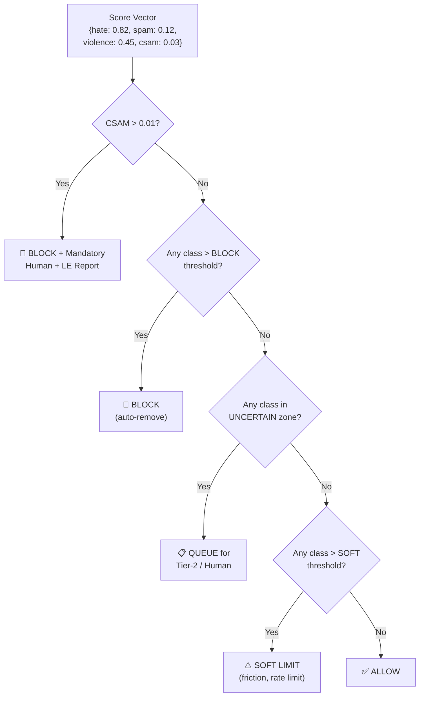

**Threshold Configuration (per class, per policy)**:

| Class | Allow | Soft Limit | Queue (uncertain) | Block |
|-------|-------|------------|-------------------|-------|
| Hate/Harassment | < 0.30 | 0.30–0.55 | 0.55–0.80 | > 0.80 |
| Spam/Scam | < 0.40 | 0.40–0.60 | 0.60–0.85 | > 0.85 |
| Violence | < 0.25 | 0.25–0.50 | 0.50–0.75 | > 0.75 |
| CSAM-adjacent | < 0.01 | — | 0.01–0.50 | > 0.50 |
| Self-harm | < 0.20 | 0.20–0.45 | 0.45–0.70 | > 0.70 |

> Thresholds are tuned by precision/recall trade-offs per class and updated via the governance process.

---

## 6. Data Flow Diagrams

### 6.1 Training Data Lifecycle

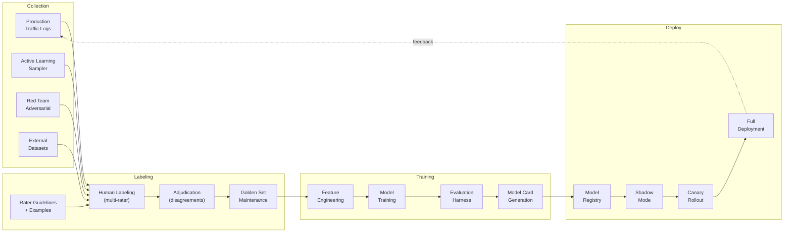

### 6.2 Audit and Compliance Data Flow

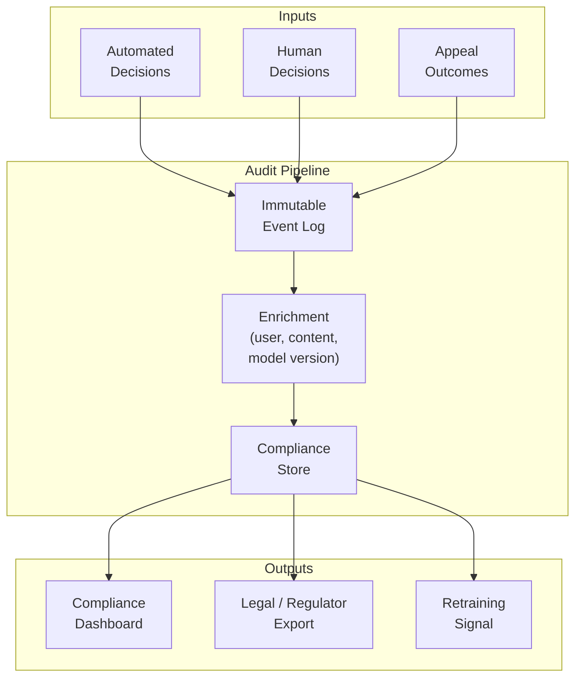

---

## 7. Decision Engine

### 7.1 Cost-Sensitive Routing Matrix

Each abuse class has an asymmetric cost profile:

```
                        PREDICTED
                   Positive    Negative
              ┌────────────┬────────────┐
   ACTUAL     │            │            │
   Positive   │  True Pos  │ False Neg  │
              │  (correct  │ (MISSED    │
              │   block)   │  ABUSE)    │
              │  Cost: 0   │ Cost: HIGH │
              ├────────────┼────────────┤
   Negative   │ False Pos  │ True Neg   │
              │ (wrongly   │ (correct   │
              │  blocked)  │  allow)    │
              │ Cost: MED  │ Cost: 0    │
              └────────────┴────────────┘
```

Cost weights vary by class:

| Class | False Negative Cost | False Positive Cost | Ratio |
|-------|-------------------|-------------------|-------|
| CSAM | Extreme | Low | 100:1 |
| Violence (threat) | Very High | Medium | 20:1 |
| Hate speech | High | High | 3:1 |
| Spam | Medium | Low | 2:1 |

### 7.2 Appeals Flow

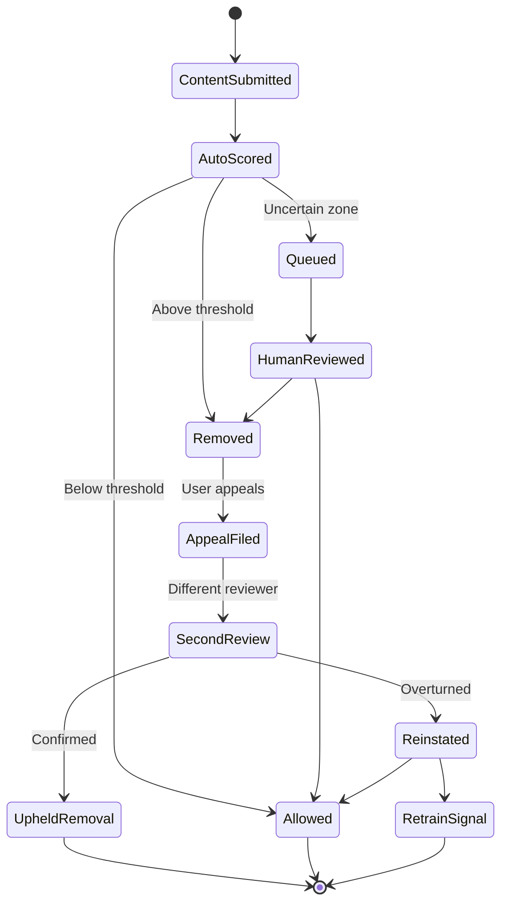

---

## 8. Scalability and Performance

### 8.1 Latency Budget (Synchronous Path)

```
┌─────────────────────────────────────────────────────────────┐
│                 200ms Total Budget (p99)                      │
│                                                             │
│  ┌──────┐  ┌──────────┐  ┌───────┐  ┌────────┐  ┌──────┐  │
│  │ Auth │  │ Features  │  │ Rules │  │ Tier-1 │  │ Fuse │  │
│  │ 5ms  │  │  25ms     │  │ 5ms   │  │  50ms  │  │ 5ms  │  │
│  └──────┘  └──────────┘  └───────┘  └────────┘  └──────┘  │
│                                                             │
│  Network overhead + serialization: ~10ms                     │
│  Buffer for spikes: ~100ms                                   │
└─────────────────────────────────────────────────────────────┘
```

### 8.2 Scaling Strategy

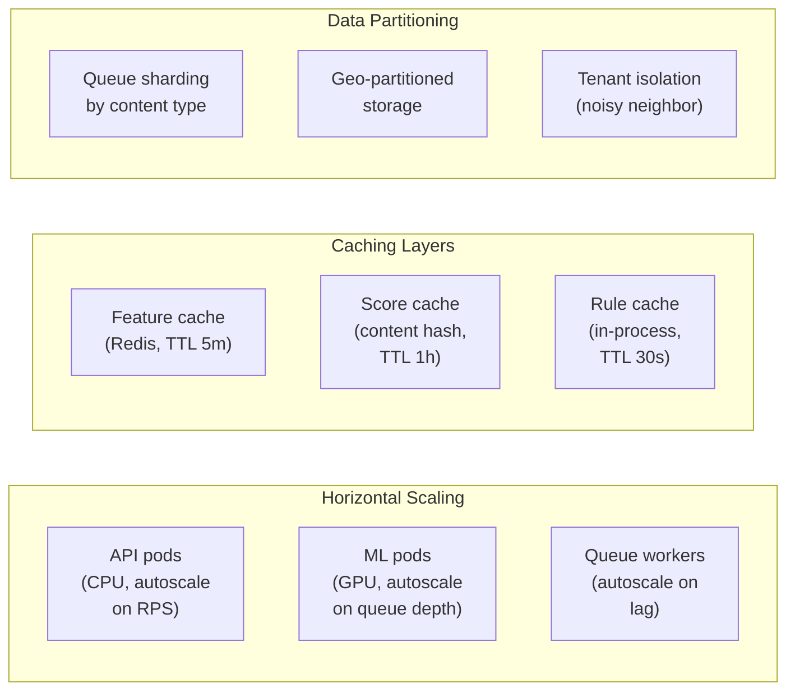

### 8.3 Target SLOs

| Metric | Target | Measurement |
|--------|--------|-------------|
| Sync latency (p50) | < 80ms | Gateway to response |
| Sync latency (p99) | < 200ms | Gateway to response |
| Availability | 99.95% | Monthly uptime |
| Throughput | 50K RPS | Sustained, per region |
| Tier-2 turnaround | < 30s (p95) | Enqueue to score |
| Human review SLA | < 4h (urgent), < 24h (standard) | Queue to decision |

---

## 9. Failure Modes and Resilience

### 9.1 Degradation Cascade

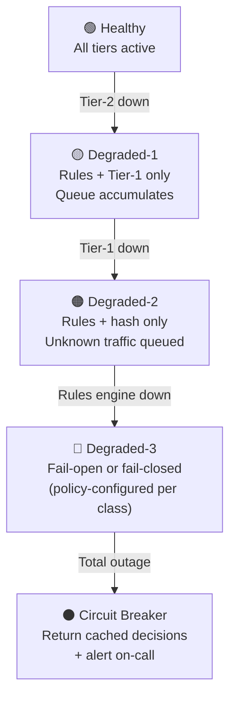

### 9.2 Failure Matrix

| Component | Failure Mode | Impact | Mitigation |
|-----------|-------------|--------|------------|
| Tier-1 GPU pool | OOM / crash | No ML scores | Fallback to rules-only; queue for async |
| Feature store | Latency spike | Slow features | In-process cache; degrade to text-only features |
| Kafka / Queue | Partition loss | Tier-2 delayed | Multi-AZ; DLQ; alert on lag |
| Rule engine | Stale rules | Missed patterns | Versioned rules in Git; health check on freshness |
| Human queue | Reviewer unavailable | SLA breach | Auto-escalate; expand pool; temporary threshold tighten |
| Model registry | Corrupt artifact | Bad predictions | Signed checksums; canary catches before full deploy |

---

## 10. Security and Compliance

### 10.1 Data Classification

```
┌────────────────────────────────────────────────────────┐
│                  DATA SENSITIVITY TIERS                  │
│                                                        │
│  ┌──────────────────────────────────────────────────┐  │
│  │  🔴 CRITICAL: CSAM hashes, LE reports            │  │
│  │     → Encrypted at rest + transit, minimal        │  │
│  │       access, regulatory retention only           │  │
│  ├──────────────────────────────────────────────────┤  │
│  │  🟠 HIGH: Raw abusive content, user PII          │  │
│  │     → Encrypted, access-logged, TTL-bound,       │  │
│  │       pseudonymized for training                  │  │
│  ├──────────────────────────────────────────────────┤  │
│  │  🟡 MEDIUM: Model scores, feature vectors        │  │
│  │     → Encrypted in transit, standard access       │  │
│  │       controls                                    │  │
│  ├──────────────────────────────────────────────────┤  │
│  │  🟢 LOW: Aggregated metrics, model cards          │  │
│  │     → Standard protection                         │  │
│  └──────────────────────────────────────────────────┘  │
└────────────────────────────────────────────────────────┘
```

### 10.2 Access Control

```mermaid
flowchart LR
    subgraph Roles
        ENG["Engineer"]
        DS["Data Scientist"]
        MOD["Moderator"]
        LEGAL["Legal / Compliance"]
        ONCALL["On-Call SRE"]
    end

    subgraph Resources
        CODE["Code & Config"]
        MODEL["Models & Weights"]
        CONTENT["Raw Content"]
        LABELS["Labels & Decisions"]
        AUDIT["Audit Logs"]
        METRICS["Dashboards"]
    end

    ENG -->|read/write| CODE
    ENG -->|read| METRICS
    DS -->|read/write| MODEL
    DS -->|read (pseudonymized)| LABELS
    MOD -->|read (case-scoped)| CONTENT
    MOD -->|write| LABELS
    LEGAL -->|read| AUDIT
    ONCALL -->|read| METRICS
    ONCALL -->|emergency write| CODE
```

---

## 11. Technology Choices

### 11.1 Recommended Stack

| Layer | Technology | Rationale |
|-------|-----------|-----------|
| **API Gateway** | Envoy / Kong / AWS API Gateway | Native gRPC + HTTP, rate limiting, observability |
| **Inference: Tier-1** | NVIDIA Triton / TorchServe on GPU | Dynamic batching, multi-model, low latency |
| **Inference: Tier-2** | Ray Serve / vLLM (for LLMs) | Elastic GPU scaling, pipeline parallelism |
| **Queue** | Apache Kafka / AWS SQS | Durable, partitioned, replay-capable |
| **Feature Store** | Feast / Redis (online) + Delta Lake (offline) | Online/offline parity, low-latency serving |
| **Rule Engine** | Open Policy Agent (OPA) / custom | Declarative, auditable, hot-reloadable |
| **Object Storage** | S3 / GCS with lifecycle policies | Encrypted, TTL, cross-region replication |
| **Audit Log** | Immutable append-only (Kafka → Iceberg) | Tamper-evident, queryable, long retention |
| **Monitoring** | Prometheus + Grafana / Datadog | Metrics, alerts, SLO tracking |
| **ML Training** | PyTorch + W&B / MLflow | Experiment tracking, reproducibility |
| **Model Registry** | MLflow / Vertex AI Model Registry | Versioning, signing, promotion gates |
| **Orchestration** | Kubernetes (EKS / GKE) | GPU node pools, autoscaling, multi-tenant |
| **CI/CD** | GitHub Actions / Argo Workflows | Model + infra pipelines |

### 11.2 Infrastructure Topology

```
┌─────────────────────────────────────────────────────────────────┐
│                         REGION: us-east-1                        │
│                                                                 │
│  ┌───────────────┐  ┌───────────────┐  ┌───────────────┐       │
│  │    AZ-1       │  │    AZ-2       │  │    AZ-3       │       │
│  │               │  │               │  │               │       │
│  │  API pods (3) │  │  API pods (3) │  │  API pods (3) │       │
│  │  GPU pods (2) │  │  GPU pods (2) │  │  GPU pods (1) │       │
│  │  Workers (4)  │  │  Workers (4)  │  │  Workers (4)  │       │
│  │  Redis node   │  │  Redis node   │  │  Redis node   │       │
│  └───────────────┘  └───────────────┘  └───────────────┘       │
│                                                                 │
│  ┌─────────────────────────────────────────────────────────┐   │
│  │  Shared: Kafka cluster (3 brokers), RDS (multi-AZ),     │   │
│  │          S3, Model Registry, Monitoring                  │   │
│  └─────────────────────────────────────────────────────────┘   │
└─────────────────────────────────────────────────────────────────┘

┌─────────────────────────────────────────────────────────────────┐
│                      REGION: eu-west-1                           │
│                  (same topology, geo-compliance)                  │
└─────────────────────────────────────────────────────────────────┘
```

---

*Next: [02-API-SPECIFICATION.md](./02-API-SPECIFICATION.md) — API contracts, request/response schemas, error codes*
